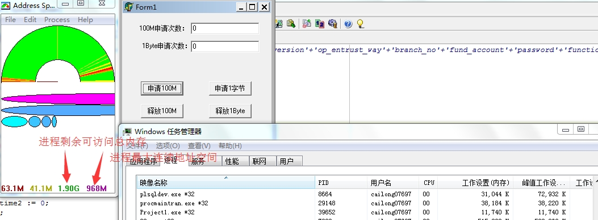
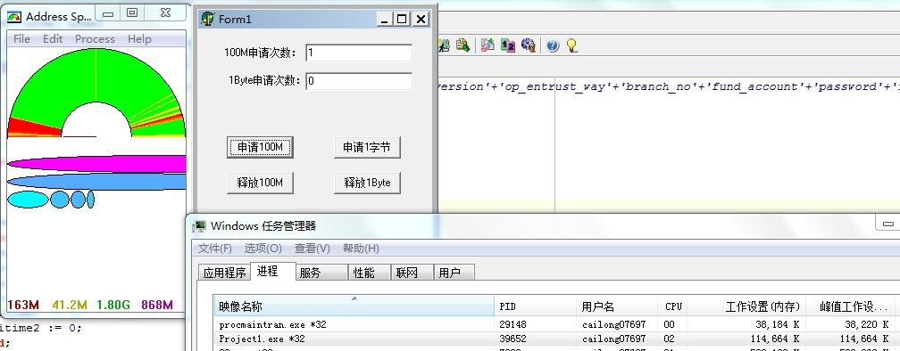
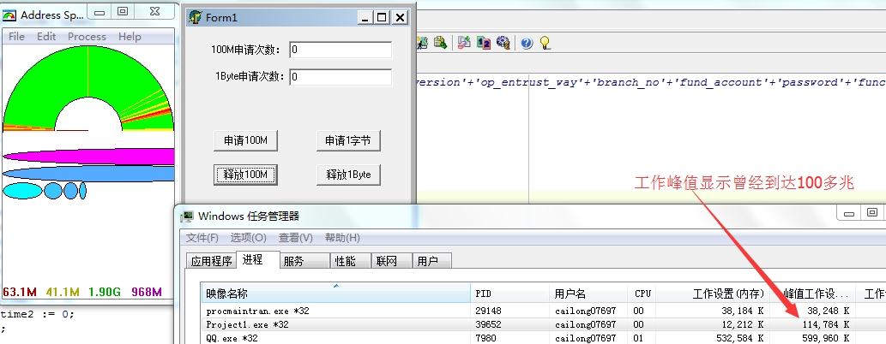
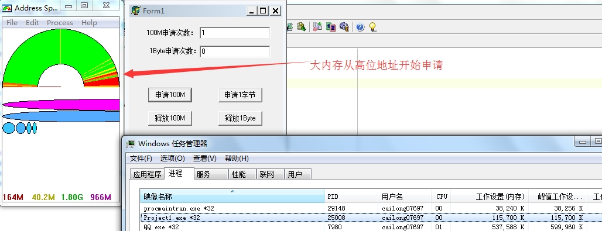
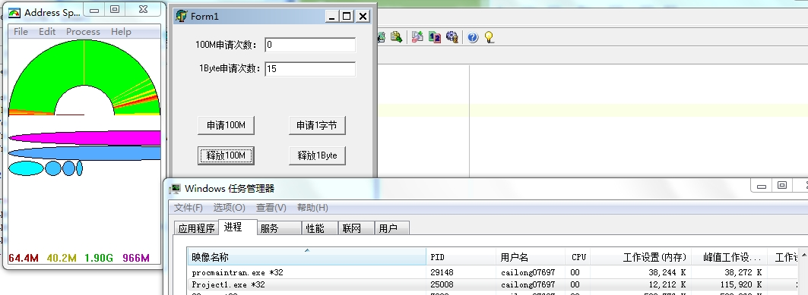
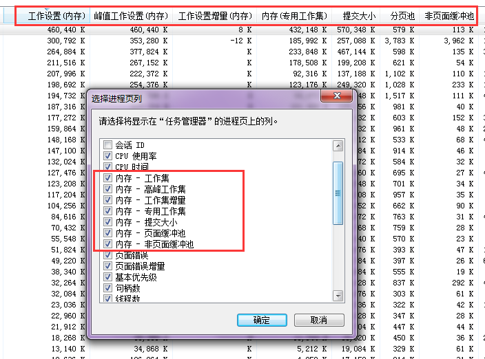
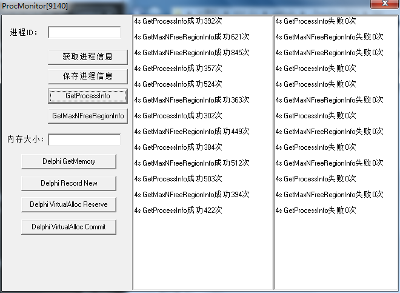

Windows平台下的监控插件

## 开发背景

遇到过进程在只占用80M内存的情况下就出现了out of memory的错误的情况

正常32位的进程，用户态内存有2G，为什么现在只用到了80M就出现了out of memory？

简单分析可能是因为内存使用不规范导致内存碎片，虽然只用了80M，但整个进程的内存已经凌乱了，没有连续的大内存了，所以想要申请连续的大内存就会因为找不到这块内存而报out of memory，虽然还有2G-80M的内存，但是没有符合要求大小的连续内存

解决方案是：

* 优化现在对内存不合理的使用，合理使用string、用固定内存代替频繁申请释放内存
* 监控内存占用、内存碎片！出现问题时及时向监控平台报告！

>所以先构建对进程内存信息的监控，后续根据需求增加比如对CPU、网络、磁盘IO等资源的监控

## 内存碎片测试

>图中的工具是[Address Space Monitor](http://www.hashpling.org/asm/)

左边的程序用来监控进程的内存占用分布情况，其中红色扇形表示内存占用情况；绿色表示内存空余情况；黄色表示待回收内存情况（可再次被申请使用），右下角的1.9G表示进程剩余可访问地址，968表示进程内连续最大空闲空间



我们进行申请1次100M内存后，从任务管理器上可以看到程序占用内存100M，同时可以观察连续最大剩余空间为868M



当释放100M内存时，可以看到内存又恢复如初始图



而这次我们间隔的申请释放100M和1Byte，申请100M-->申请1Byte-->释放100M-->申请100M-->申请1Byte-->释放100M...

模拟每次1Byte的少了内存泄漏，如下图，可以看到十几次后，几乎所有内存都被使用过，而最大连续的空闲内存只剩余80M左右，无法再满足下一次申请100M，而Windows资源管理器中的工作内存，可以看到只有15M左右


>所以小内存泄漏和任务频繁申请释放内存会造成内存碎片，最后无法申请有效内存报out of memory

## 内存碎片解决方案

针对内存碎片造成的out of memory，计划从下面方面进行解决

* 一方面解决从程序中的内存泄漏
* 一方面减少从程序中频繁没有必要的内存申请，即对于组装返回的包体，通过预申请固定内存进行打包
* 另一方面从程序底层的内存管理机制上进行优化，使用fastmm重写的borlandmm.dll替换delphi原生的borlndmm.dll进行内存管理

先申请一次100M，可以看到大内存从高地址开始申请



我们间隔的申请释放100M和1Byte，申请100M-->申请1Byte-->释放100M-->申请100M-->申请1Byte-->释放100M...可以看到十几次往复后，如果再次释放100M，则内存会完美下降下去



## Windows下的内存泄漏检测方法

>参考[《从零开始的 JSON 库教程（三）：解析字符串解答篇》](https://zhuanlan.zhihu.com/p/22664202)

在Windows下，可使用Visual C++的[C Runtime Library(CRT)检测内存泄漏](https://msdn.microsoft.com/zh-cn/library/x98tx3cf.aspx)

首先在.c文件首行插入这一段代码

```c
#ifdef _WINDOWS
#define _CRTDBG_MAP_ALLOC
#include <crtdbg.h>
#endif
```

并在main()开始位置插入

```c
int main()
{
#ifdef _WINDOWS
    _CrtSetDbgFlag(_CRTDBG_ALLOC_MEM_DF | _CRTDBG_LEAK_CHECK_DF;
#endif
}
```

按F5生成、开始调试程序。如果有内存泄漏，在输出中会看到内存泄漏信息

```
Detected memory leaks!
Dumping objects ->
C:\GitHub\json-tutorial\tutorial03_answer\leptjson.c(212) : {79} normal block at 0x013D9868, 2 bytes long.
 Data: <a > 61 00 
Object dump complete.
```

从输出信息中`...{79}...`知道是在第79次分配的内存出问题，可以加上`_CrtSetBreakAlloc(79);`来调试，那么它便会在第79次时中断与分配调用的位置，那时候就能从调用堆栈去找出来龙去脉

## Linux/OSX下的内存泄漏检测方法

>参考[《从零开始的 JSON 库教程（三）：解析字符串解答篇》](https://zhuanlan.zhihu.com/p/22664202)

在Linux、OS X下，我们可以使用[valgrind](http://valgrind.org/)工具（用`apt-get install valgrind`、`brew install valgrind`）

不像Windows下检测内存泄漏，用这个工具完全不用修改代码，只要在命令行执行

```
$ valgrind --leak-check=full  ./leptjson_test
==22078== Memcheck, a memory error detector
==22078== Copyright (C) 2002-2015, and GNU GPL'd, by Julian Seward et al.
==22078== Using Valgrind-3.11.0 and LibVEX; rerun with -h for copyright info
==22078== Command: ./leptjson_test
==22078== 
--22078-- run: /usr/bin/dsymutil "./leptjson_test"
160/160 (100.00%) passed
==22078== 
==22078== HEAP SUMMARY:
==22078==     in use at exit: 27,728 bytes in 209 blocks
==22078==   total heap usage: 301 allocs, 92 frees, 34,966 bytes allocated
==22078== 
==22078== 2 bytes in 1 blocks are definitely lost in loss record 1 of 79
==22078==    at 0x100012EBB: malloc (in /usr/local/Cellar/valgrind/3.11.0/lib/valgrind/vgpreload_memcheck-amd64-darwin.so)
==22078==    by 0x100008F36: lept_set_string (leptjson.c:208)
==22078==    by 0x100008415: test_access_boolean (test.c:187)
==22078==    by 0x100001849: test_parse (test.c:229)
==22078==    by 0x1000017A3: main (test.c:235)
==22078== 
...
```

它发现了在`test_access_boolean()`中，由`lept_set_string()`分配的2个字节("a")泄露了

Valgrind还有很多功能，例如发现未初始化的变量等

## Windows资源管理器

>参考[《windows任务管理器中的工作设置内存,内存专用工作集,提交大小详解》](http://shashanzhao.com/archives/832.html)

>参考[《内存详解》](http://www.cnblogs.com/georgepei/archive/2012/03/07/2383548.html)

打开Windows的资源管理器可以用于查看系统的内存、CPU等信息，也可以查看某个进程的CPU、内存信息。但是仔细看，怎么有这么多类型的内存统计项，它们分别表示什么含义？



**工作设置(工作集)**指程序占用的物理内存（包含与其他程序共享的一部分），其值等于`专用工作集 + 与其他进程共享的物理内存`

**高峰工作集(峰值工作设置)**指进程所使用的工作设置的最大数量

**工作集增量(工作设置增量)**指进程所使用的工作设置的更改量

**专用工作集**指程序独占的物理内存

**提交大小**指进程独占的内存，包括物理内存和在页面文件中的内存，其值等于`专用工作集 + 保存在页面文件中的独占内存`

**页面缓冲池(分页池)**指可以写入其他存储媒体（如硬盘）的某个进程的认可虚拟内存数量

**非页面缓冲池**指无法写入其他存储媒体的某个进程的认可虚拟内存数量

补充其他名词说明：

* Virtual Size：程序总的所使用的内存（包含共享、非共享、物理、页面、为程序保留的但未分配的内存
* Committed：Virtual Size减去为程序保留的但未分配的内存
* 为程序保留一的但未分配的内存：就是告诉系统我要一块内存，但暂时用不到，不过分配的地址得给我，系统就给它一个不用的地址，但不分配内存，等程序申请要使用时，就从页面或物理内存中分配出来放在那个地址上

下面通过代码来详细了解，程序main.exe定义了5M的全局变量、5M的常量、并申请5M的内存，程序代码大小为2M

```c
char g_str[5 * 1024 * 1024];       //5M的全局变量
const char STR[5 * 1024 * 1024];   //5M的常量

void main()
{
    //申请5M的内存
    char *p = (char *)HeapAlloc(GetProcessHeap(), 0, 5 * 1024 * 1024);

    //调用lib.dll的导出方法
    call_lib();
}
```

程序lib.dll定义了4M的全局变量、4M的常量，并申请了一个4M的内存，程序代码大小为1M

```c
char g_str[4 * 1024 * 1024];
const char STR[4 * 1024 * 1024];

void call_lib()
{
    char *p = (char *)HeapAlloc(GetProcessHeap(), 0, 5 * 1024 * 1024);
}
```

main.exe程序调用了lib.dll

先看main.exe占用总的内存

```
Virtual Size
= 5M全局变量 + 5M常量 + 5M堆内存 + 2M程序代码 
  + 4M全局变量 + 4M常量 + 4M堆内存 + 1M程序代码
= 30M
```

然后看main.exe独占的内存

```
Private Bytes
= 5M全局变量 + 5M内存
  + 4M全局变量 + 4M的内存
= 18M
```

可以看出独占指的是只能进程自己使用，比如代码、常量等就是共享的；分配的内存、可变的全局或静态变量就是独占的

## Windows堆内存详述

在[《Windows下32位进程内存模型》](http://www.xumenger.com/01-windows-process-memory-20170101/)、[《Linux下32位进程内存模型》](http://www.xumenger.com/02-linux-process-memory-20170101/)中有讲到32位进程的内存模型是这样的（当时Linux下的测试情况显示Linux下进程确实比较符合这种模型，但是Windows下的测试结果和这个图有所出入，只能作为一个大概念层面的参考）


关于栈、代码段等没有必要再讲解了，我在研究软件调试的时候对这几部分内存已经有了比较深刻的理解了。下面继续针对Windows 32位进程的内存进行讲解和说明

在[《汇编与逆向基础：VC++6.0 调试模式下探究Win32进程堆内存模型》](http://www.xumenger.com/windows-vcpp-debug-20161203/)也讲到在VC++ Debug编译模式下，进程的堆内存是通过双向链表的形式进行管理的

堆一般不是连续的，所以管理堆也比较麻烦，像[《汇编与逆向基础：VC++6.0 调试模式下探究Win32进程堆内存模型》](http://www.xumenger.com/windows-vcpp-debug-20161203/)讲的那样，它是通过双向链表进行管理的。程序可以拥有若干个堆，每个堆都有自己的句柄，访问堆中的内容时先要找到这个堆，然后再遍历链表，这也是堆内存访问慢的一个原因

《Windows核心编程》一书中有对于Windows内存结构、堆内存、堆内存推荐用法的详细解释

**MEMORY\_BASIC\_INFORMATION结构体**

```c
DWORD VirtualQueryEx(
    HANDLE hProcess,
    LPCVOID pvAddress,
    PMEMORY_BASIC_INFORMATION pmbi,
    DWORD dwLength);

typedef struct _MEMORY_BASIC_INFORMATION{
	PVOID BaseAddress;        //等于将参数pvAdress向下取整到页面的大小
	PVOID AllocationBase;     //区域的基地址，该区域包含参数pvAddress所指定的地址
	DWORD AllocationProtect;  //在最开始预定区域时为该区域指定的保护属性
	SIZE_T RegionSize;        //块（虽然命名为RegionSize）的大小(Byte)。区域的起始地址是BaseAddress，区域中所有页面有相同的保护属性、状态和类型
	DWORD State;              //区域中页面的状态(MEM_FREE、MEM_RESERVE、MEM_COMMIT)
	DWORD Protect;            //针对所有相邻的页面，表示它们的保护属性(PAGE_*)
	DWORD Type;               //区域中页面的类型(MEM_IMAGE、MEM_MAPPED、MEM_PRIVATE)
} MEMORY_BASIC_INFORMATION, * PMEMORY_BASIC_INFORMATION;
```

**VMQUERY结构体**

```c
BOOL VMQuery(
    HANDLE hProcess,
    LPCVOID pvAddress,
    PVMQUERY pVMQ
);

typedef struct{
    //Region information(区域信息)
    PVOID  pvRgnBaseAddress;   //虚拟地址空间区域的起始地址
    DWORD  dwRgnProtection;    //最开始预订地址空间区域时为该区域保护的保护属性，PAGE_*
    SIZE_T RgnSize;            //所预订区域的大小(Byte)
    DWORD  dwRgnStorage;       //区域中各块的物理存储器的类型，MEM_*: Free, Image, Mapped, Private
    DWORD  dwRgnBlocks;        //区域中块的个数
    DWORD  dwRgnGuardBlks;     //区域中具有PAGE_GUARD保护属性标志的块的数量，如果是1表示这个区域是为了线程栈而预订的
    BOOL   bRgnIsAStack;       //该区域是否包含线程栈。该值是通过近似猜测得到的

    //Block information(块信息)
    PVOID  pvBlkBaseAddress;   //块的起始地址，该块包含了参数pvAddress所指定的地址
    DWORD  dwBlkProtection;    //块的保护属性，PAGE_*
    SIZE_T BlkSize;            //块的大小(Byte)
    DWORD  dwBlkStorage;       //块的存储器类型，MEM_*: Free, Image, Mapped, Private, Reserved
} VMQUERY, *PVMQUERY;
```

**物理后备存储器类型值域解释**

* `MEM_FREE`：闲置（区域和块属性），区域的虚拟内存地址没有任何后备存储器。该地址空间尚未被预订，应用程序既可以从其基地址开始预订区域，也可以从闲置区域内的任何地址开始预订区域
* `MEM_RESERVED`：保留（块属性），表示该块没有任何后备的物理存储器
* `MEM_PRIVATE`：私有（区域和块属性），区域的虚拟内存以系统的页交换文件为后备存储器
* `MEM_IMAGE`：映像（区域和块属性），区域的虚拟地址一开始以映像文件（dll、exe等）为后背存储器，但此后不一定以映像文件为后备存储器。例如，如果程序写入映射文件中的一个全局变量，那么写时复制机制会改用页交换文件来作为后备存储器
* `MEM_MAPPED`：已映射（区域和块属性），区域的虚拟地址一开始以内存映射文件作为后备存储器，但此后不一定以内存映射文件为后备存储器。例如，内存映射文件可能会使用写时复制保护属性。任何写操作会使对应的页面改用页交换文件来作为后备存储器

## 项目简介

针对以上的介绍，开发一个Windows下的DLL插件，并公开调用的接口，供调用者调用获得进程的内存占用情况，有以下功能：

* 获取工作集
* 获取高峰工作集
* 获取工作增量集
* 获取专用工作集
* 获取提交大小
* 获取页面缓冲池
* 获取非页面缓冲池
* 获取最大连续内存情况
* 获取前N大的空闲内存
* 将进程内存结构信息输出到HTML

>扩展：我在[win32-windbg-memory-detail](https://github.com/HackerLaboratory/_Crack/tree/master/20170816~2017mmdd-win32-windbg-memory-detail)使用这个插件和WinDbg对Win32进程内存模型进行了详细的梳理，是很好的一系列文章

## 项目测试

接下来对于项目进行简单的测试：

* 测试1s可以调用多少次接口
* 测试大量频繁调用接口的情况下有没有内存增长问题

**第一次测试**

调用GetProcessInfo和GetMaxNFreeRegionInfo(每次取前最大的前10个)，根据多次调用的情况看，4s能调用约400次，平均100次/s，很显然这个太慢了



这么看这个性能确实太差了。分析一下程序，里面轮询内存块获取信息的部分因为轮询大量的内存块会导致时间复杂度激增！

## 更多参考资料

* [《windows进程中的内存结构（好多API，而且VC最聪明）》](http://www.cnblogs.com/findumars/p/5929827.html)
* [《内存管理[2]》](http://www.cnblogs.com/h2zZhou/p/6649770.html)
* [《内存管理[3]堆》](http://www.cnblogs.com/h2zZhou/p/6649779.html)
* [《内存管理[5]通过 GetProcessHeaps 函数获取了当前进程的堆句柄列表》](http://www.cnblogs.com/h2zZhou/p/6649786.html)
* [《Windows内存管理的API函数》](http://blog.csdn.net/bizhu12/article/details/6808364)
* [Memory Performance Information](https://msdn.microsoft.com/en-us/library/aa965225.aspx)
* [C Runtime Library(CRT)检测内存泄漏](https://msdn.microsoft.com/zh-cn/library/x98tx3cf.aspx)
